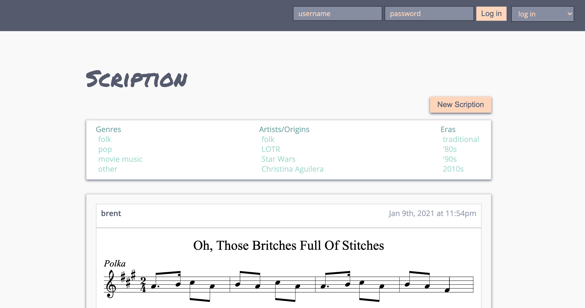
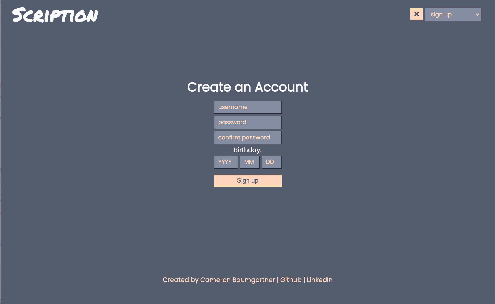
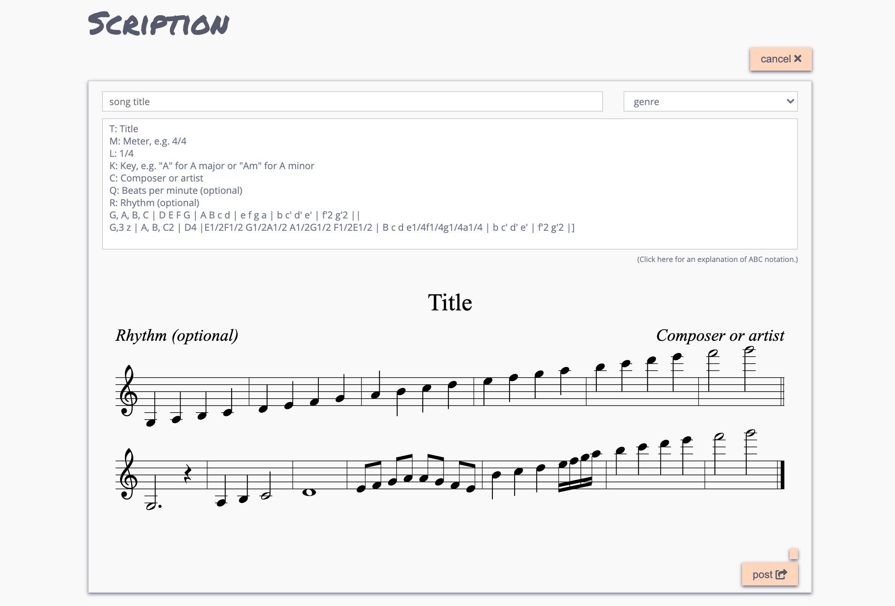
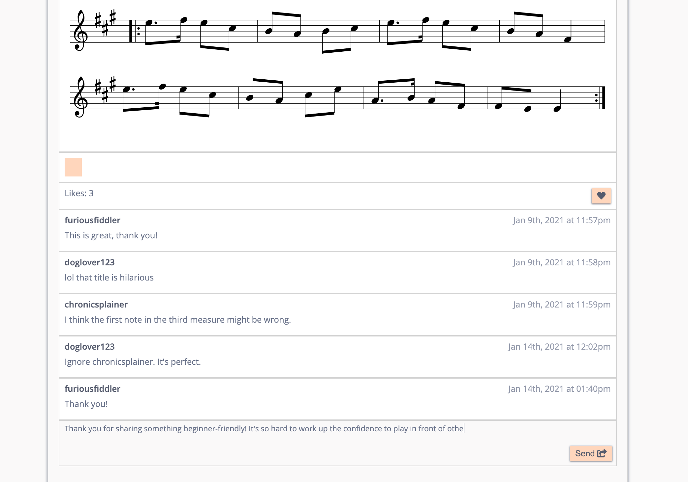
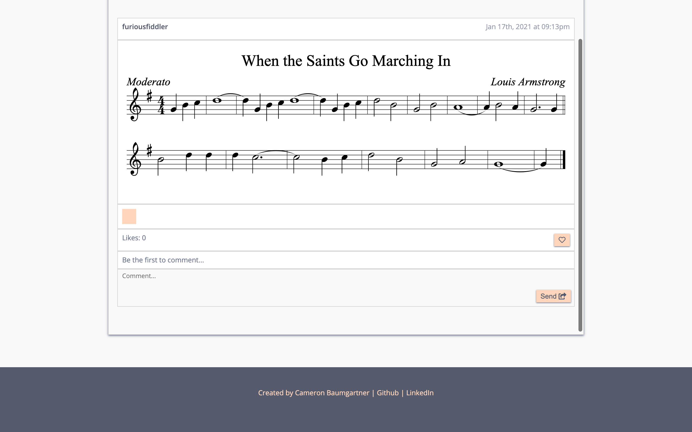
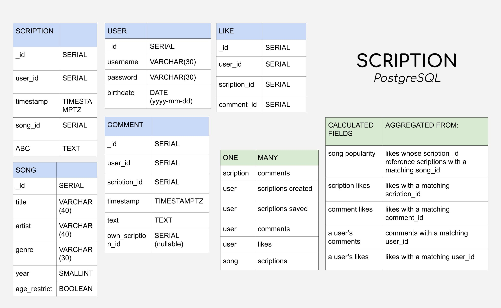

# A social media for sheet music.

A community for music makers to find and share original compositions and transcriptions of their favorite songs. 

Want to know how to play Britney Spears' "Toxic" on the bassoon? Chances are some helpful violinist has already transcribed it. Just save the sheet music (called a "scription") to your folder, hit "transpose," and voila -- now you've got the sheet music for "Toxic" in bass clef. While you're at it, give that helpful violinist a "like" to say thank you for their work.

Want to find Irish tunes to play at your local session? Before you pack up for the pub, use the navbar to filter your feed by genre, era, or artist. Add the scriptions you're interested in to a list and hit "share" to email them to your fiddling friends, or save the list for easy retrieval on your mobile device later.

Problem in the third measure? You can comment on the author's scription to let them know, or provide your own, edited version of their scription. But be nice -- Scription runs on social currency. Each piece of sheet music you save to your music folder costs a little reputation. Your reputation will grow when others like your scriptions or your comments, so pitch in!

Upload your own scription using the Scription Creator, a sandbox where you can type in note names and see and hear an instantly updated preview of your composition. Save your in-progress scriptions to a "drafts" folder, and your favorite scriptions by others in a "favorites" folder. 

## To run:

Scription is not yet in deployment. To play around in version 1.0, please fork and clone this repo to your local machine. In your terminal, navigate to the Scription folder. Run `npm install` then `npm run prod`, then navigate to localhost:3000 in your browser. 

Until Scription is deployed, you'll need to make your own Postgres instance to enable the database features. Supply the connection string for your database at line 3 of server/controllers/feedController.js. You can execute the file dump.sql to supply it with dummy data. To do so, run this command in your terminal: `psql YOUR-CONNECTION-STRING-HERE -f dump.sql`. 

## v. 1.1.0
*Home page*

*Sign up*

*Scription Creator*

*Likes and comments*

*Footer and feed scroll*

## Tech Stack

Built using React, Express, and PostgreSQL. Sheet music renderings and audio playback powered by [abcjs](https://github.com/paulrosen/abcjs).

*Scription's relational database schema:*

---

### Completed Features

- create and share scriptions using the Scription Creator
- see constantly-updating visual preview of sheet music as you type your scription
- buffer and play constantly-updating audio preview of your scription
- add titles, composers, and other annotations to your sheet music
- display scriptions in a feed
- add comments and likes to a scription
- display comments and likes on each scription
- play synthesized audio for each scription
- user authentication: read and write users to db, API, bcrypt, and cookies 

### In Progress

- bug fix: duplicate scriptions being created
- UX/UI for audio playback widgets

### Upcoming Features

- user folders: drafts and favorites
- user may provide suggested edits to a scription within a comment
- filter the feed using provided categories
- easy transposition between keys and between clefs
- audio playback will obey bpm if specified in the scription
- more authentication features: log out, forgot/reset password
