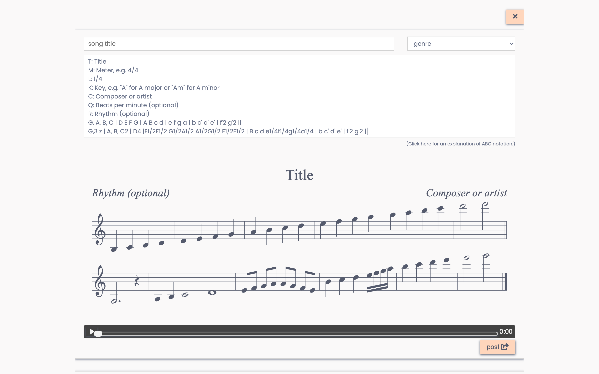

# A social media for sheet music.

[**See it deployed →**](https://scription-heroku.herokuapp.com/)

A community for music makers to find and share original compositions and transcriptions of their favorite songs. 

Upload your own Scription using the Scription Creator, a sandbox where you can type in note names and see and hear an instantly updated preview of your composition. Give likes and comments to other users' Scriptions to show your appreciation.

## Screenshots: v. 1.1.0
*Home page*

*Sign up*

*Scription Creator*

*Feed, likes, and comments*

## Tech Stack

Built using React, Express, and PostgreSQL. Sheet music renderings and audio playback powered by [abcjs](https://github.com/paulrosen/abcjs). Hosted on Heroku.

*Scription's relational database schema:*

---

### Completed Features

- create and share scriptions using the Scription Creator
- see constantly-updating visual preview of sheet music as you type your scription
- buffer and play constantly-updating audio preview of your scription
- add titles, composers, and other annotations to your sheet music
- display scriptions in a feed
- add comments and likes to a scription
- display comments and likes on each scription
- play synthesized audio for each scription
- user authentication: read and write users to db, API, bcrypt, and cookies

### In Progress

- performance improvements (espec. re: HTTP requests for audio)
- form validation for Scription Creator
- folders: drafts and favorites

### Upcoming Features

- provide suggested edits to a scription within a comment
- filter the feed using provided categories
- easy transposition between keys and between clefs
- audio playback will obey bpm if specified in the scription
- more authentication features: log out, forgot/reset password
